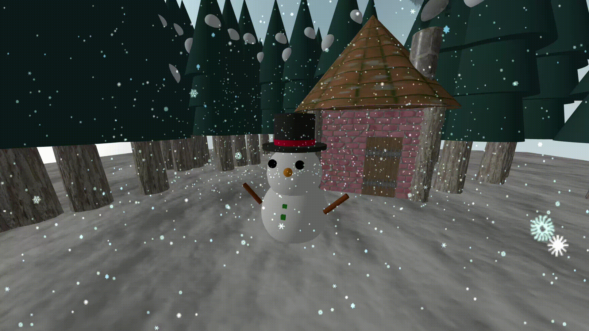

# SNOWMAN threejs




An assignment for Computer graphics class

Migrated from original Repository [kojun1108/Melting-snowman](https://github.com/kojun1108/Melting-snowman)

This repository start from template
[Three.js + Vite + TypeScript starter](https://github.com/pachoclo/vite-threejs-ts-template)

- [Demo](https://yunkai1841.github.io/snowman-threejs/)
- [Jump to CLI commands](#cli-commands)

## Stuff included in the scene

- snowman
- sky
- ground
- forest
- house
- snow

## Tech Stack

- Three.js
- GLSL
- TypeScript
- Vite

## CLI Commands

Installation

Require [nodejs](https://nodejs.org/en)
```bash
npm i
```

Run dev mode

```bash
npm run dev
```

Build

```bash
npm run build
```

Run build

```bash
npm run preview
```

## Texture used

- Snowflakes :  https://github.com/mrdoob/three.js/tree/dev/examples/textures/sprites

- House
  - Roof : https://3dtextures.me/2019/11/06/roof-tiles-terracotta-003/
  - Wall : https://3dtextures.me/2021/03/26/stylized-bricks-001/
  - Poll (trunk) : https://3dtextures.me/2022/02/25/bark-pine-003/
  - Chimney : https://3dtextures.me/2022/04/03/wall-stone-023/
  - Door : https://3dtextures.me/2020/05/29/wood-gate-fortified-003/
  - Smoke : https://www.photo-ac.com/main/search?q=%E7%85%99+%E9%80%8F%E9%81%8E&srt=dlrank&qt=&pp=70&pt=B&p=1


